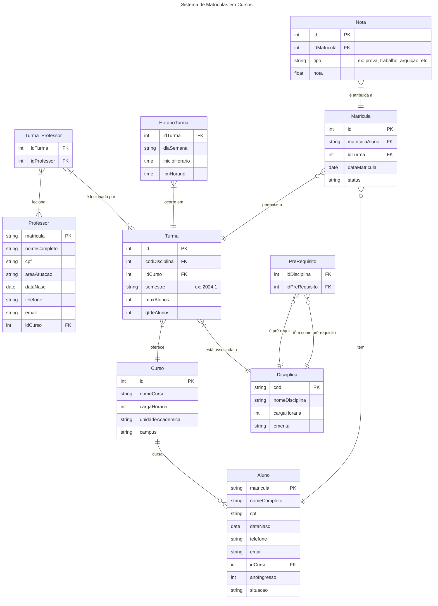

# Universidade - Sistema de Matrículas

Este repositório contém a modelagem de um sistema de matrículas, desenvolvida como parte de uma atividade acadêmica. O objetivo foi projetar um modelo que representasse a estrutura de um sistema de matrículas, abrangendo entidades e seus relacionamentos.

## Modelagem

Abaixo está o diagrama representando o modelo criado para o sistema de matrículas:

## Próximos Passos

Como sugestão do professor, após a modelagem conceitual, foi indicado que implementássemos o modelo em um banco de dados relacional e uma API para consumir e manipular os dados com o objetivo de reforçar os estudos.

## Tecnologias Utilizadas

Para a implementação do banco de dados:

- PostgreSQL

Para o desenvolvimento da API:

- .NET 6
- ASP.NET Core

---

Além das entidades relacionadas ao sistema de matrículas, foi adicionada uma classe extra chamada Administrador. Para essa classe, foram implementados mecanismos de autenticação e autorização utilizando JWT (JSON Web Token), garantindo que apenas usuários autorizados possam acessar determinadas funcionalidades do sistema.
